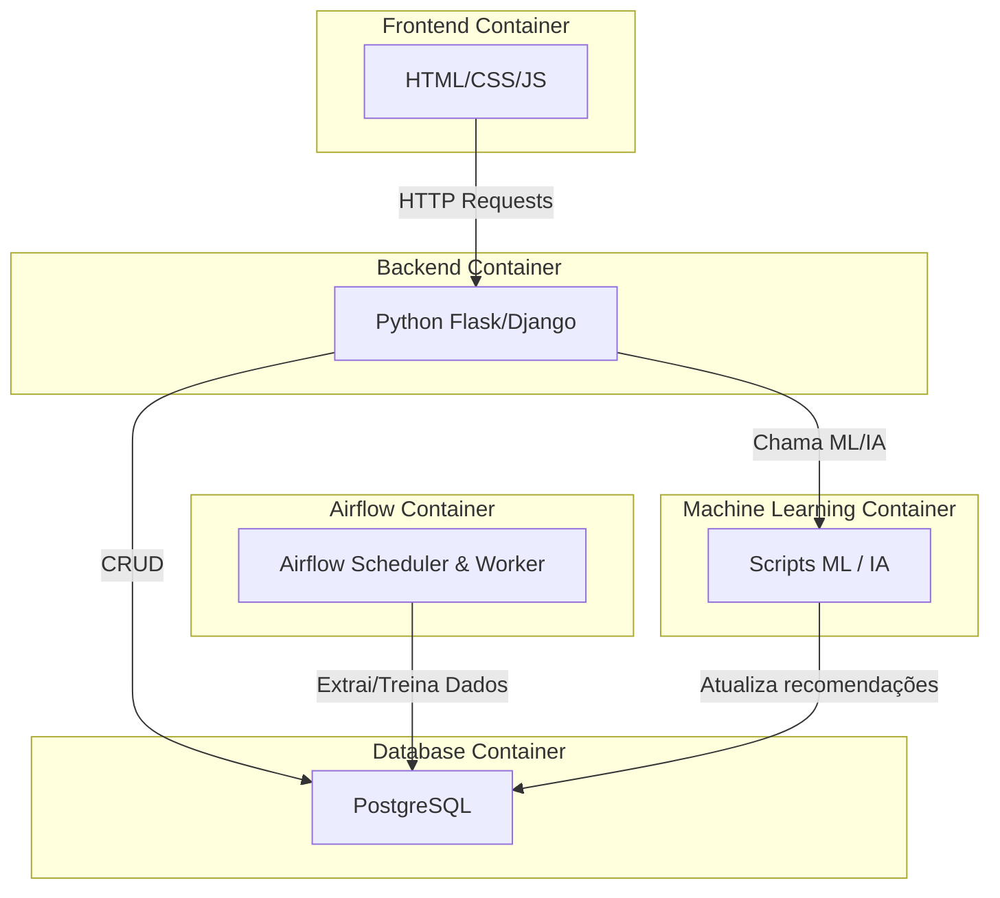

```mermaid

flowchart TD
    subgraph FRONTEND [Frontend Container]
        FE[HTML/CSS/JS]
    end

    subgraph BACKEND [Backend Container]
        BE[Python Flask/Django]
    end

    subgraph DB [Database Container]
        DBS[PostgreSQL]
    end

    subgraph AIRFLOW [Airflow Container]
        AF[Airflow Scheduler & Worker]
    end

    subgraph ML [Machine Learning Container]
        MLModel[Scripts ML / IA]
    end

    %% Fluxo de comunicação
    FE -->|HTTP Requests| BE
    BE -->|CRUD| DBS
    BE -->|Chama ML/IA| MLModel
    AF -->|Extrai/Treina Dados| DBS
    MLModel -->|Atualiza recomendações| DBS

```
