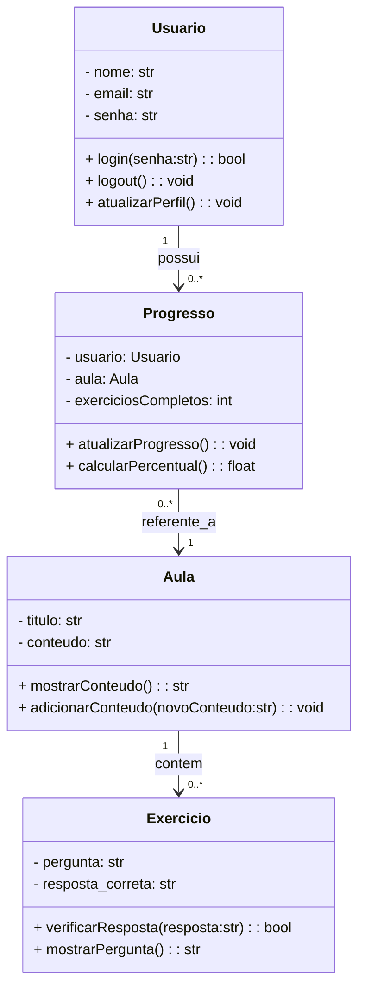

```mermaid

classDiagram
    class Usuario {
        - nome: str
        - email: str
        - senha: str
        + login(senha:str): bool
        + logout(): void
        + atualizarPerfil(): void
    }

    class Aula {
        - titulo: str
        - conteudo: str
        + mostrarConteudo(): str
        + adicionarConteudo(novoConteudo:str): void
    }

    class Exercicio {
        - pergunta: str
        - resposta_correta: str
        + verificarResposta(resposta:str): bool
        + mostrarPergunta(): str
    }

    class Progresso {
        - usuario: Usuario
        - aula: Aula
        - exerciciosCompletos: int
        + atualizarProgresso(): void
        + calcularPercentual(): float
    }

    Usuario "1" --> "0..*" Progresso : possui
    Aula "1" --> "0..*" Exercicio : contem
    Progresso "0..*" --> "1" Aula : referente_a

```