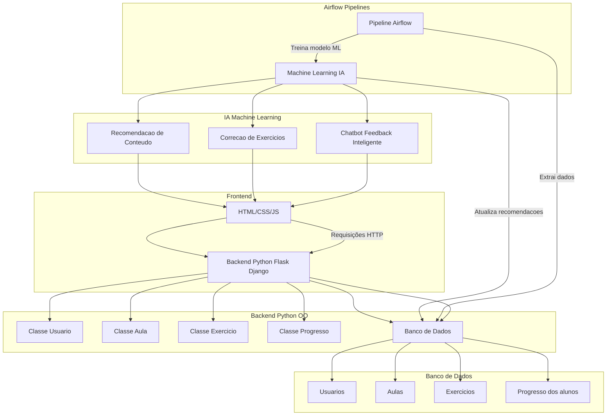

```mermaid

flowchart TD
    %% Frontend
    subgraph FRONTEND [Frontend]
        A[HTML/CSS/JS] -->|Requisições HTTP| B[Backend Python Flask Django]
    end

    %% Backend
    subgraph BACKEND [Backend Python OO]
        B --> C[Classe Usuario]
        B --> D[Classe Aula]
        B --> E[Classe Exercicio]
        B --> F[Classe Progresso]
        B --> G[Banco de Dados]
    end

    %% Banco de Dados
    subgraph DB [Banco de Dados]
        G --> H[Usuarios]
        G --> I[Aulas]
        G --> J[Exercicios]
        G --> K[Progresso dos alunos]
    end

    %% Airflow
    subgraph AIRFLOW [Airflow Pipelines]
        L[Pipeline Airflow] -->|Extrai dados| G
        L -->|Treina modelo ML| M[Machine Learning IA]
        M -->|Atualiza recomendacoes| G
    end

    %% Inteligência Artificial
    subgraph IA [IA Machine Learning]
        M --> N[Chatbot Feedback Inteligente]
        M --> O[Correcao de Exercicios]
        M --> P[Recomendacao de Conteudo]
    end

    %% Fluxo geral
    A --> B
    B --> G
    N --> A
    O --> A
    P --> A

```